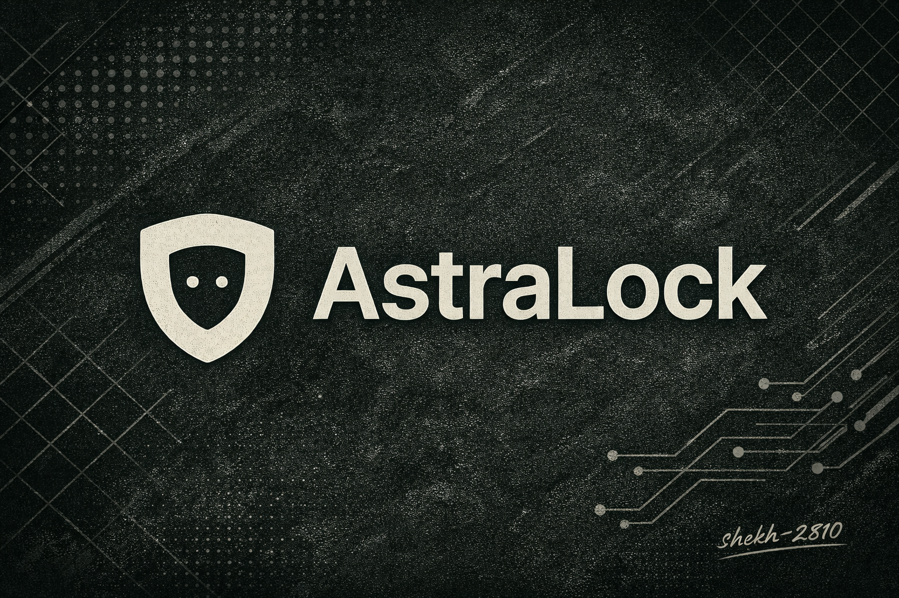

# AstraLock 

**AstraLock** is a **Linux biometric authentication system** that enables **face-based login** through **PAM** and **systemd**, designed to be **offline, auditable, and hackable**, offering a native Linux alternative to projects like *Howdy* and closed platforms such as *Windows Hello* without cloud dependencies.

It runs a local daemon that performs facial verification and integrates directly with system authentication flows such as `sudo`, `login`, `display managers`, and `polkit`.

<p align="center">  </p>

## What AstraLock Is

- A system daemon that performs face verification

- A PAM module (pam_facelock.so) for system authentication

- A CLI tool for enrollment, verification, and testing

- A local-only LBPH model (no cloud, no network)

*No external services.*
*No telemetry.*
*No vendor lock-in.*

## Features

- 🔐PAM authentication (`login`, `sudo`, `polkit`, `display managers`)
- 🧠Offline facial recognition *(LBPH, OpenCV)*
- ⚙️systemd-managed daemon lifecycle
- 📷 Webcam support via OpenCV
- 🧪Built-in testing via `pamtester`
- Simple CLI for users and admins

---

## Architecture
```bash 
                                   PAM (sudo / login / DM)
                                             │
                                             ▼
                                      pam_facelock.so
                                             │
                                             ▼
                                facelockd (systemd service)
                                             │
                                             ▼
                         UNIX socket (/run/facelock/facelock.sock)
                                             │
                                             ▼
                              Face models (/var/lib/facelock)
```


---

## Supported Distros

| Distro        | Status |
|---------------|--------|
| Debian        | ✅ Supported | 
| Ubuntu        | ✅ Supported |
| Kali Linux    | ✅ Supported |
| Arch Linux    | ⚠️ (manual deps) |
| Fedora        | ⚠️ (SELinux rules needed) |

---

## Dependencies

### Debian / Ubuntu / Kali

```bash
sudo apt install -y \
  cmake ninja-build g++ \
  libpam0g-dev libaudit-dev \
  libopencv-dev \
  pkg-config \
  python3 python3-opencv \
  socat pamtester jq
```
---

## Instalation 

```bash
git clone https://github.com/shekh-2810/AstraLock.git
cd AstraLock
sudo scripts/install_facelock.sh <username>

```

#### Example

```bash
sudo scripts/install_facelock.sh shekh-2810
```
This will:

- Build and install the daemon

- Build and install the PAM module

- Install and enable the systemd service

- Enroll face samples

- Train the local model

- Verify PAM authentication
--- 

## CLI Usage
#### Enroll / Update Face
```bash
sudo facelock enroll <username>
```

- Replaces existing samples

- Retrains the face model

- Reloads the daemon
  
#### Verify Face (direct)
```bash
sudo facelock verify <username>
```

Returns JSON result from daemon.
```bash
{ "ok": true, "match": true }
```

#### Test PAM
```bash
sudo facelock test <username>
```

Runs pamtester.

Uses `pamtester` to validate PAM integration.

---

## Enabling PAM on System

**⚠️ Proceed carefully. Always keep a root shell open.**

- #### Enable for sudo

Edit:
```bash
sudo nano /etc/pam.d/sudo
```

Add above `@include common-auth`:
```bash
auth sufficient pam_facelock.so
```

- #### Enable for login (TTY)
```bash
sudo nano /etc/pam.d/login
```

Add:
```bash
auth sufficient pam_facelock.so
```


- #### Enable for GUI (GDM / SDDM / LightDM)
  
**GDM**
```bash
sudo nano /etc/pam.d/gdm-password
```

**SDDM**
```bash
sudo nano /etc/pam.d/sddm
```

Add:
```bash
auth sufficient pam_facelock.so
```
**Polkit (GUI sudo prompts)**
```bash
sudo nano /etc/pam.d/polkit-1
```

Add:
```bash
auth sufficient pam_facelock.so
```
---

## Project Status & Roadmap

**AstraLock** is actively maintained and currently in *Version 1* (**v1**).

#### This release focuses on:

- Stability of the daemon and PAM integration

- Reliable offline face recognition

- Clean install / uninstall behavior

- Deterministic authentication paths (no UI hacks)

#### Future releases will focus on:

- Improved low-light and angle handling

- Faster recognition paths

- Better camera abstraction

- Hardening against edge-case PAM failures

- Optional advanced models (still offline)

### *AstraLock exists because existing solutions (notably Howdy) suffer from:*

- Fragile camera handling

- Inconsistent PAM behavior

- Poor low-light performance

- Limited extensibility for contributors

## Uninstall
```bash
sudo scripts/uninstall_facelock.sh
```

**Removes:**

- daemon

- PAM module

- systemd service

- user face data

### **Security Notes**

- *Face authentication is sufficient, not exclusive*

- *Password fallback remains available*

- *No biometric data leaves system*

- *Models stored locally*

### Development
**Build only**
```bash
cmake -S . -B build
cmake --build build -j
```
**Clean rebuild**
```bash
rm -rf build build-pam
```

## **Disclaimer**

**Biometric authentication is inherently probabilistic.**

Do **not** rely on face authentication as your only recovery method.

Always keep an alternative login path available.

### License

- AstraLock: MIT

- cnpy: Retains its original license


