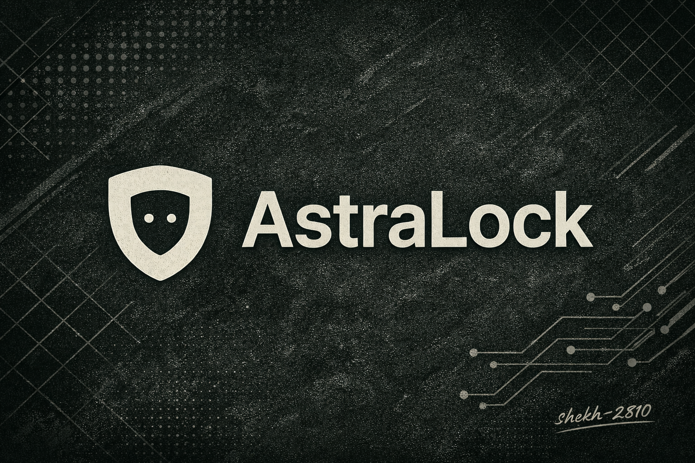

# AstraLock

**AstraLock** is a Linux biometric authentication system enabling face-based 
login through PAM and systemd — offline, auditable, and hackable.

[](assets/banner.png)

---

## What AstraLock Is
- A systemd daemon performing face verification via ONNX ArcFace embeddings
- A PAM module (`pam_facelock.so`) for system authentication
- A CLI for enrollment, verification, and testing
- Fully local — no cloud, no telemetry, no vendor lock-in

---

## Architecture
```
Application (sudo / login / GUI)
            │
            ▼
         PAM
            │
            ▼
    pam_facelock.so
            │
            ▼
facelockd (systemd daemon)
            │
            ▼
  UNIX socket IPC (v2 protocol)
            │
            ▼
  ArcFace ONNX embeddings
  (/var/lib/facelock/<user>)
```

---

## Recognition Pipeline (v2.0)
```
Camera frame
    │
    ▼
RetinaFace detector (FaceDetectorYN)
    │
    ▼
Landmark-based face alignment (112×112)
    │
    ▼
ArcFace ONNX embedding (512-dim)
    │
    ▼
Cosine distance → match/no-match
```

---

## Supported Distros

| Distro | Status |
|---|---|
| Debian | ✅ Supported |
| Ubuntu | ✅ Supported |
| Kali Linux | ✅ Supported |
| Arch Linux | 🚧 Planned |
| Fedora | 🚧 Planned |

---

## Dependencies
```bash
apt install -y \
  cmake ninja-build g++ \
  libpam0g-dev libaudit-dev \
  libopencv-dev libspdlog-dev \
  nlohmann-json3-dev pkg-config \
  python3 python3-opencv \
  netcat-openbsd pamtester jq wget
```

ONNX Runtime and models are downloaded automatically by the installer.

---

## Installation
```bash
git clone https://github.com/shekh-2810/AstraLock.git
cd AstraLock
sudo scripts/install_facelock.sh <username>
```

This will:
- Install dependencies + ONNX Runtime
- Download ArcFace and detector models
- Build and install the daemon + PAM module
- Enroll your face and verify PAM integration

---

## CLI Usage
```bash
sudo facelock enroll <username>   # capture + generate embeddings
sudo facelock verify <username>   # direct auth test
sudo facelock test <username>     # full PAM integration test
```

---

## Enabling PAM

⚠️ Always keep a root shell open before editing PAM files.

**sudo:**
```bash
sudo nano /etc/pam.d/sudo
# add above @include common-auth:
auth sufficient pam_facelock.so
```

**login / display managers:**
```bash
sudo nano /etc/pam.d/login       # TTY
sudo nano /etc/pam.d/gdm-password  # GDM
sudo nano /etc/pam.d/sddm          # SDDM
# add:
auth sufficient pam_facelock.so
```

---

## Uninstall
```bash
sudo scripts/uninstall_facelock.sh
```

---

## Security Notes
- Face auth is **sufficient**, not exclusive — password fallback always active
- Biometric data never leaves the machine
- All models run locally

---

## License
AstraLock: MIT | cnpy: original license
