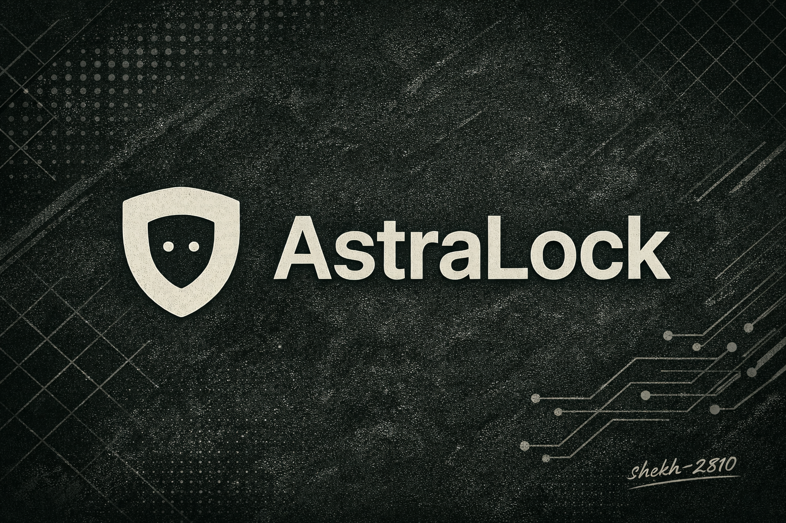

# AstraLock 

**AstraLock** is a **Linux biometric authentication system** that enables **face-based login** through **PAM** and **systemd**, designed to be **offline, auditable, and hackable**, offering a native Linux alternative to projects like *Howdy* and closed platforms such as *Windows Hello* without cloud dependencies.

It runs a local daemon that performs facial verification and integrates directly with system authentication flows such as `sudo`, `login`, `display managers`, and `polkit`.

<p align="center">  </p>

## What AstraLock Is

- A system daemon (`facelockd`) that performs face verification

- A PAM module (`pam_facelock.so`) for system authentication

- A CLI tool (`facelock`) for enrollment, verification, listing, deletion, and testing

- A local-only ONNX model (no cloud, no network)

*No external services.*
*No telemetry.*
*No vendor lock-in.*

## Features

- 👁️ Liveness detection 
- 🔐PAM authentication (`login`, `sudo`, `polkit`, `display managers`)
- 📐 Per-user threshold calibration at enrollment time
- 🧠Offline facial recognition
- ⚙️systemd-managed daemon lifecycle
- 💬 Real-time PAM conversation feedback
- 🧪Built-in testing via `pamtester`
-  Simple CLI for users and admins
- 🔒 AppArmor drop-in installed automatically
---

## Installation 
```bash
git clone https://github.com/shekh-2810/AstraLock.git
cd AstraLock
sudo bash scripts/install_facelock.sh <username>
```

#### Example

```bash
sudo scripts/install_facelock.sh shekh-2810
```
This will:

- Install all build dependencies
  
- Build and install the daemon

- Build and install the PAM module

- Install and enable the systemd service

- Enroll face samples

- Train the local model

- Verify PAM authentication


## Quick Start
```bash
# Enroll your face
facelock enroll <username>

# Verify face directly
facelock verify <username>

# List enrolled users
facelock list

# Delete a user's face data
facelock delete <username>

# Test PAM integration
sudo facelock test <username>

# Uninstall everything
sudo scripts/uninstall_facelock.sh

```


## Configuration 
Config file: `/etc/facelock/facelock.conf`
```bash
CAMERA_DEVICE=0                   # index for /dev/videoN — use ls /dev/video* to find yours
ONNX_THRESHOLD=0.40               # fallback threshold; per-user threshold set at enrollment
ONNX_MODEL_PATH=/usr/share/facelock/models/w600k_mbf.onnx
DATA_DIR=/var/lib/facelock
SOCKET_PATH=/run/facelock/facelock.sock
LIVENESS_ENABLED=true             # set false to disable blink check (less secure)
LIVENESS_TEXTURE_MIN=0.15         # minimum texture score to pass liveness
LIVENESS_BLINK_FRAMES=10          # frames to observe for blink detection
```
After editing, restart the daemon:

`sudo systemctl restart facelock`

---

## Architecture
```bash
                          Application (sudo / login / GUI)
                                         │
                                         ▼
                              PAM (sudo / login / DM)
                                         │
                                         ▼
                                   pam_facelock.so
                                   (3 attempts, PAM
                                  conversation feedback)
                                         │
                                         ▼
                              facelockd (systemd service)
                              IPC thread pool, v3 protocol
                                         │
                                         ▼
                           UNIX socket (/run/facelock/facelock.sock)
                                         │
                                         ▼
                             ArcFace ONNX inference (512-dim)
                             Per-user threshold + liveness check
                             (/var/lib/facelock/<user>_emb.bin)
```
## Recognition Pipeline (v3.0)
```
                                      Camera frame
                                           │
                                           ▼
                           RetinaFace detector (FaceDetectorYN)
                                           │
                                           ▼
                               Liveness check (blink via EAR,
                                 texture score — auth only)
                                           │
                                           ▼
                           Landmark-based alignment (5-pt → 112×112)
                                           │
                                           ▼
                             ArcFace ONNX embedding (512-dim)
                                           │
                                           ▼
                             Cosine distance vs stored embeddings
                                           │
                                           ▼
                             Per-user calibrated threshold → match
```

---

## Supported Distros

| Distro        | Status |
|---------------|--------|
| Debian        | ✅ Supported | 
| Ubuntu        | ✅ Supported |
| Kali Linux    | ✅ Supported |
| Arch Linux    | 🔧 Build portable |
| Fedora/RHEL   | 🔧 Build portable |

---

## Dependencies

### Debian / Ubuntu / Kali

```bash
apt install -y \
  cmake ninja-build g++ \
  libpam0g-dev libaudit-dev \
  libopencv-dev libspdlog-dev \
  nlohmann-json3-dev pkg-config \
  python3 python3-opencv \
  netcat-openbsd pamtester jq wget
```
---

## CLI Usage
#### Enroll / Update Face
```bash
sudo facelock enroll <username>
```

- Replaces existing samples

- Retrains the face model

- Reloads the daemon
  
#### Verify Face (direct)
```bash
sudo facelock verify <username>
```

Returns JSON result from daemon.
```bash
{
  "err": null,
  "match": true,
  "ok": true,
  "score": 0.03415735438466072,
  "v": 2
}

```

#### Test PAM
```bash
sudo facelock test <username>
```

Runs pamtester.

Uses `pamtester` to validate PAM integration.

#### List Enrolled Users
```bash
facelock list
```

Returns the list of users:
```bash
[*] Enrolled users:
  shekh-2810  (samples: 12, threshold: 0.3241)
```


---

## Project Status & Roadmap

**AstraLock** is actively maintained and currently in *Version 3.0* (**v3.0**).

#### This release focuses on:

- Real-time PAM conversation feedback — live status messages during authentication
- Multi-user support — enroll and manage multiple users independently
- Liveness detection — blink detection via EAR and texture scoring against photo/video spoofing
- Per-user threshold calibration — cosine distance threshold tuned to each user's environment at enrollment
- Username sanitisation fix — special characters like ' no longer break enrollment commands
- Expanded CLI — list, delete, and help commands added alongside existing enroll and verify
  
#### Future releases will focus on:

- One-command install for all distros — Arch Linux and Fedora/RHEL currently require manual portable build; a unified installer script is planned
- Camera access under systemd — V4L2 backend fails due to cgroup isolation; GStreamer pipeline fallback needed
- Unit tests — scoring logic, config parsing, liveness pipeline, and IPC protocol edge cases
- Low-light performance — preprocessing improvements for poor ambient lighting conditions
- Multi-angle enrollment — capture samples across varied lighting and head poses for better real-world accuracy
- Live enrollment preview — real-time camera feed with face box


### *AstraLock exists because existing solutions (notably Howdy) suffer from:*

- Fragile camera handling

- Inconsistent PAM behavior

- Poor low-light performance

- Limited extensibility for contributors

## Uninstall
```bash
sudo scripts/uninstall_facelock.sh
```

**Removes:**

- daemon

- PAM module

- systemd service

- user face data

### **Security Notes**

- *Face authentication is sufficient, not exclusive*

- *Password fallback remains available*

- *No biometric data leaves system*

- *Models stored locally*

### Development
**Build only**
```bash
cmake -S . -B build
cmake --build build -j
```
**Clean rebuild**
```bash
rm -rf build build-pam
```

## **Disclaimer**

**Biometric authentication is inherently probabilistic.**

Do **not** rely on face authentication as your only recovery method.

Always keep an alternative login path available.

### License

- AstraLock: MIT

- cnpy: Retains its original license


